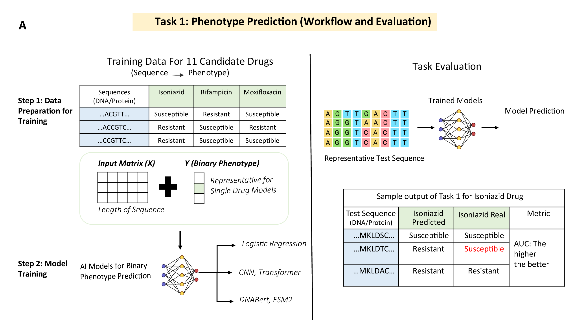
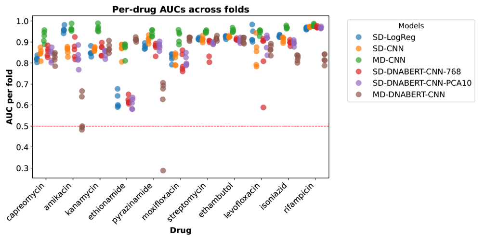
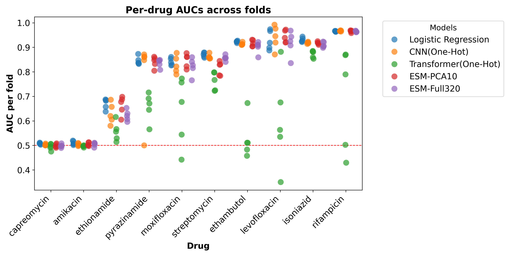
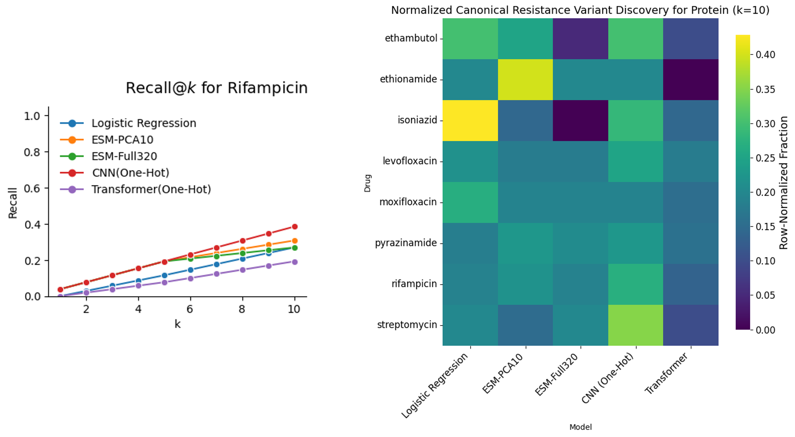

# BIG-TB: A benchmark for prediction and interpretability of sequence-based machine learning using *Mycobacterium tuberculosis* genomes

BIG-TB is a reproducible benchmark for evaluating biological sequence models on clinically grounded tuberculosis resistance tasks. The benchmark pairs curated *M. tuberculosis* genomes, drug susceptibility phenotypes, and canonical resistance-variant annotations with model-ready DNA and protein inputs for comparing classical machine learning, one-hot neural networks, and foundation-model-based sequence representations.

## Benchmark At a Glance

- **17,942 clinical isolates** with phenotype and variant data
- **DNA and protein modalities** derived from the same underlying genomic cohort
- **11 antibiotics** across first-line and second-line resistance settings
- **Two benchmark tasks**:
  - **Task 1:** phenotype prediction
  - **Task 2:** canonical resistance variant discovery
- **Standardized evaluation outputs** for prediction, significance testing, and interpretation against the WHO mutation catalogue

## Benchmark Tasks

### Task 1: Phenotype prediction
Given DNA or protein sequence inputs, predict binary resistance phenotype (`R` / `S`) for each drug.

### Task 2: Canonical resistance variant discovery
Given a trained model, evaluate whether model attributions recover known WHO resistance-conferring loci rather than relying only on predictive accuracy.

## Architectural Framework

<p align="center">
  
</p>

The benchmark starts from curated variant calls and phenotype labels, reconstructs aligned DNA and protein sequence inputs at resistance loci, and evaluates multiple model families on standardized prediction and interpretability tasks.

## Main Findings

- Simple baselines remain strong comparators for both DNA- and protein-based resistance prediction.
- DNA models generally outperform protein models because DNA inputs preserve non-coding and rRNA-mediated resistance signal.
- Protein foundation-model embeddings are competitive for several drugs, but they do not uniformly outperform simpler models.
- High predictive performance does not automatically imply good recovery of canonical resistance loci.
- Drug difficulty is strongly mechanism-dependent: rifampicin and isoniazid are consistently strong prediction tasks, while amikacin and capreomycin remain challenging for protein-only models.

## Task 1 Benchmark Results

<p align="center">
  
  
</p>

Across the original benchmark, DNA-based models generally achieve the highest predictive performance because they preserve coding, non-coding, and rRNA-mediated resistance signal. Protein-based models remain strong for drugs whose resistance determinants are predominantly protein-coding, while performance degrades for drugs where key mechanisms fall outside the modeled proteins.

## Lineage-Aware Robustness Evaluation

We also provide a lineage-aware protein evaluation using leave-one-major-lineage-out splits. Held-out test sets are defined by top-level *M. tuberculosis* lineages 1-4, while training uses all remaining lineage-annotated isolates. This analysis is intended as a robustness check for population structure effects in a clonal pathogen.

### Original protein benchmark vs. lineage-aware robustness

| Drug | Original protein benchmark (Task 1 test AUC) | Lineage-aware robustness (mean held-out-lineage AUC) |
| --- | --- | --- |
| Rifampicin | paper ~0.961-0.969 | lineage ~0.960-0.963 |
| Isoniazid | paper ~0.907-0.920 | lineage ~0.903-0.922 |
| Ethambutol | paper ~0.885-0.923 | lineage ~0.898-0.905 for CNN/regression |
| Pyrazinamide | paper ~0.626-0.851 | lineage ~0.774-0.792 for main models |
| Streptomycin | paper ~0.784-0.858 | lineage ~0.763-0.796 |
| Moxifloxacin | paper ~0.796-0.820 | lineage ~0.787-0.808 |
| Ethionamide | paper ~0.534-0.663 | lineage ~0.505-0.613 |
| Amikacin | paper ~0.500-0.510 | lineage ~0.486-0.507 |
| Capreomycin | paper ~0.489-0.503 | lineage ~0.483-0.500 |

Compact lineage result tables are available in:

- `protein-tasks/data/latest/lineage_ood_all_train/combined/lineage_holdout_mean_auc_by_drug.csv`
- `protein-tasks/data/latest/lineage_ood_all_train/combined/lineage_holdout_per_split_results.csv`

## Task 2 Benchmark Results

Task 2 evaluates whether model attributions recover known WHO resistance-conferring loci instead of only achieving high phenotype-prediction accuracy. The heatmap below summarizes recall of canonical resistance sites across drugs and model families.

<p align="center">
  
</p>

## Repository Layout

```text
Big-TB-benchmark/
├── dna-tasks/                  # DNA-based benchmark models and evaluation
├── protein-tasks/              # Protein translation, model training, and lineage-aware evaluation
├── BIG_TB_isolates_with_lineages.csv
└── README.md
```

Within `protein-tasks/`, the main workflow components are:

- `protein_translation/`: variant-to-protein reconstruction and preprocessing
- `regression/`: Ref-Alt feature baselines
- `one_hot_encoded/`: CNN and Transformer models on aligned protein sequences
- `esm_models/`: ESM embedding-based protein models
- `summarize_lineage_results.py`: aggregation of lineage-holdout outputs into compact result tables

## Reproducibility

The repository contains model-ready data handling, training, and evaluation code for both modalities. For the protein lineage-aware analysis, the main aggregated outputs are written under:

- `protein-tasks/data/latest/lineage_ood_all_train/`

Task-specific implementation details and additional artifact trees live in the corresponding subdirectories under `dna-tasks/` and `protein-tasks/`.

## Citation

If you use BIG-TB in your work, please cite:

> Tasmin M, Mohanty S, Kulkarni S, Farhat MR, Green AG. BIG-TB: A benchmark for prediction and interpretability of sequence-based machine learning using *Mycobacterium tuberculosis* genomes. bioRxiv. 2026.01.30.702134. doi: https://doi.org/10.64898/2026.01.30.702134

## Acknowledgments

- WHO mutation catalogue for tuberculosis resistance
- ESM protein language models (Meta AI)
- SAGE Lab, University of Massachusetts Amherst
