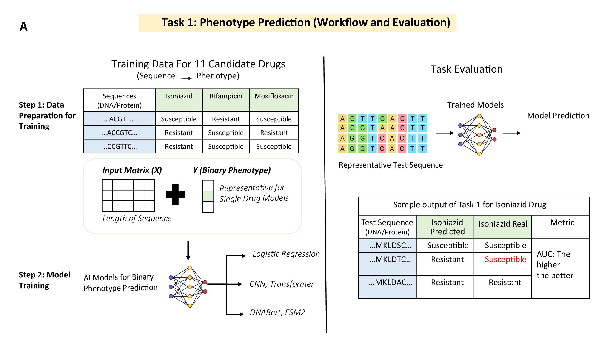
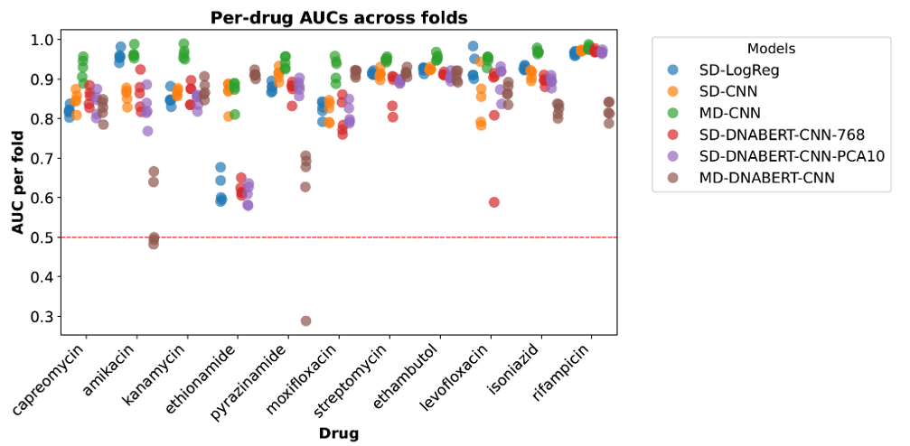
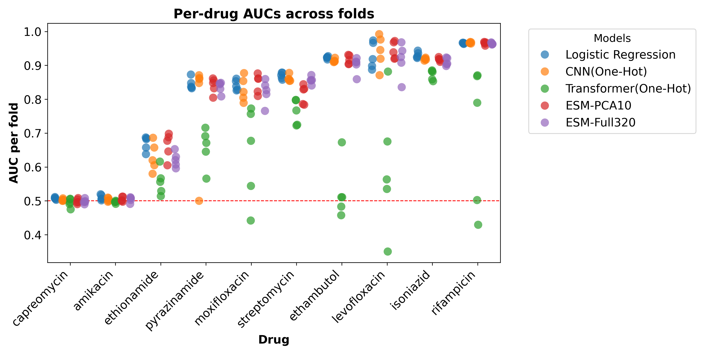
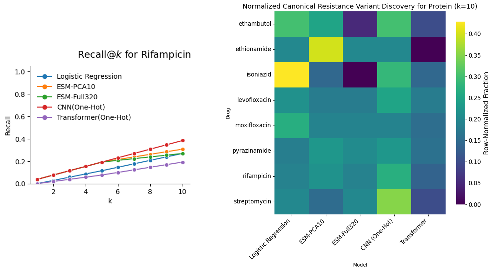

# BIG-TB: A benchmark for prediction and interpretability of sequence-based machine learning using *Mycobacterium tuberculosis* genomes

BIG-TB is a reproducible benchmark for evaluating biological sequence models on clinically grounded tuberculosis resistance tasks. The benchmark pairs curated *M. tuberculosis* genomes, drug susceptibility phenotypes, and canonical resistance-variant annotations with model-ready DNA and protein inputs for comparing classical machine learning, one-hot neural networks, and foundation-model-based sequence representations.

## Benchmark At a Glance

- **17,942 clinical isolates** with phenotype and variant data
- **DNA and protein modalities** derived from the same underlying genomic cohort
- **11 antibiotics** across first-line and second-line resistance settings
- **Two benchmark tasks**:
  - **Task 1:** phenotype prediction
  - **Task 2:** canonical resistance variant discovery
- **Standardized evaluation outputs** for prediction, significance testing, and interpretation against the WHO mutation catalogue

## Benchmark Tasks

### Task 1: Phenotype prediction
Given DNA or protein sequence inputs, predict binary resistance phenotype (`R` / `S`) for each drug.

### Task 2: Canonical resistance variant discovery
Given a trained model, evaluate whether model attributions recover known WHO resistance-conferring loci rather than relying only on predictive accuracy.

## Architectural Framework

<p align="center">
  
</p>

The benchmark starts from curated variant calls and phenotype labels, reconstructs aligned DNA and protein sequence inputs at resistance loci, and evaluates multiple model families on standardized prediction and interpretability tasks.

## Main Findings

- Simple baselines remain strong comparators for both DNA- and protein-based resistance prediction.
- DNA models generally outperform protein models because DNA inputs preserve non-coding and rRNA-mediated resistance signal.
- Protein foundation-model embeddings are competitive for several drugs, but they do not uniformly outperform simpler models.
- High predictive performance does not automatically imply good recovery of canonical resistance loci.
- Drug difficulty is strongly mechanism-dependent: rifampicin and isoniazid are consistently strong prediction tasks, while amikacin and capreomycin remain challenging for protein-only models.

## Task 1 Benchmark Results

<p align="center">
  
  
</p>

Across the original benchmark, DNA-based models generally achieve the highest predictive performance because they preserve coding, non-coding, and rRNA-mediated resistance signal. Protein-based models remain strong for drugs whose resistance determinants are predominantly protein-coding, while performance degrades for drugs where key mechanisms fall outside the modeled proteins.

## Lineage-Aware Robustness Evaluation

We also provide a lineage-aware protein evaluation using leave-one-major-lineage-out splits. Held-out test sets are defined by top-level *M. tuberculosis* lineages 1-4, while training uses all remaining lineage-annotated isolates. This analysis is intended as a robustness check for population structure effects in a clonal pathogen.

### Original protein benchmark vs. lineage-aware robustness

| Drug | Original protein benchmark (Task 1 test AUC) | Lineage-aware robustness (mean held-out-lineage AUC) |
| --- | --- | --- |
| Rifampicin | paper ~0.961-0.969 | lineage ~0.960-0.963 |
| Isoniazid | paper ~0.907-0.920 | lineage ~0.903-0.922 |
| Ethambutol | paper ~0.885-0.923 | lineage ~0.898-0.905 for CNN/regression |
| Pyrazinamide | paper ~0.626-0.851 | lineage ~0.774-0.792 for main models |
| Streptomycin | paper ~0.784-0.858 | lineage ~0.763-0.796 |
| Moxifloxacin | paper ~0.796-0.820 | lineage ~0.787-0.808 |
| Ethionamide | paper ~0.534-0.663 | lineage ~0.505-0.613 |
| Amikacin | paper ~0.500-0.510 | lineage ~0.486-0.507 |
| Capreomycin | paper ~0.489-0.503 | lineage ~0.483-0.500 |

Compact lineage result tables are available in:

- `protein-tasks/data/latest/lineage_ood_all_train/combined/lineage_holdout_mean_auc_by_drug.csv`
- `protein-tasks/data/latest/lineage_ood_all_train/combined/lineage_holdout_per_split_results.csv`

## Task 2 Benchmark Results

Task 2 evaluates whether model attributions recover known WHO resistance-conferring loci instead of only achieving high phenotype-prediction accuracy. The heatmap below summarizes recall of canonical resistance sites across drugs and model families.

<p align="center">
  
</p>

The accompanying [protein Task 2 variant-support table](supplementary_data/task2_protein_who_variant_support.csv) reports, for each WHO Group 1 or Group 2 protein substitution represented in the model inputs, its WHO confidence group, model-ready cohort size, carrier count, and resistant/susceptible carrier counts. These are BIG-TB cohort-specific counts.

## Repository Layout

```text
Big-TB-benchmark/
├── dna-tasks/                  # DNA-based benchmark models and evaluation
├── protein-tasks/              # Protein translation, model training, and lineage-aware evaluation
├── BIG_TB_isolates_with_lineages.csv
└── README.md
```

Within `protein-tasks/`, the main workflow components are:

- `protein_translation/`: variant-to-protein reconstruction and preprocessing
- `regression/`: Ref-Alt feature baselines
- `one_hot_encoded/`: CNN and Transformer models on aligned protein sequences
- `esm_models/`: ESM embedding-based protein models
- `summarize_lineage_results.py`: aggregation of lineage-holdout outputs into compact result tables

## Evo2 Embeddings and Lineage-Aware DNA Training

This section describes the frozen-embedding workflow: generate layer-20 Evo2 token embeddings, convert them to the memmap layout used by the downstream models, and train a classifier while holding out one major MTB lineage. It is separate from supervised Evo2 LoRA finetuning under `dna-tasks/Evo2/finetuning/`.

Run all commands below from the Evo2 directory:

```bash
cd dna-tasks/Evo2
```

The workflow has three required stages:

1. `submit_evo2_embedding_array.sh` submits one resumable GPU array task per gene.
2. `evo2_embed_gen.utils.prepare_memmaps` converts the raw `.npy` batches into downstream memmaps.
3. `zero_shot/lineage_aware/train_lineage_holdout_classifier.sh` makes the lineage split and trains the downstream classifier.

The shell entry points are named for the operation they perform:

| Script | Purpose |
| --- | --- |
| `generate_evo2_embeddings.sh` | Run one embedding job; supports both smoke-test and production-array settings. |
| `submit_evo2_embedding_array.sh` | Submit `generate_evo2_embeddings.sh` as one Slurm array task per gene. |
| `train_random_split_classifier.sh` | Train the downstream classifier with a random split. |
| `zero_shot/lineage_aware/train_lineage_holdout_classifier.sh` | Train the downstream classifier while holding out one lineage. |
| `zero_shot/lineage_aware/evaluate_lineage_holdout_classifier.sh` | Evaluate a saved classifier on its held-out lineage. |
| `submit_slurm_job.sh` | Submit any one of the Slurm job scripts with shared site settings. |
| `evo2_env.sh` | Source-only shared runtime configuration and shell helpers. |
| `setup_evo2_env.sh` | Create the original UMass-specific Conda environment. |

The two former embedding workers were consolidated into `generate_evo2_embeddings.sh`; set `SMOKE_TEST=1` for the small validation run. The duplicate launcher under the legacy `lineage_aware_data_split/` directory was removed. The maintained frozen-embedding lineage workflow is under `zero_shot/lineage_aware/`.

### 1. Environment and site configuration

Create a Python 3.12 environment and install the pinned Evo2 inference and downstream-training dependencies:

```bash
conda create -n bigtb-evo2 python=3.12 -y
conda activate bigtb-evo2
python -m pip install -r requirements.txt
```

The provided `setup_evo2_env.sh` performs the same installation using UMass-specific Conda paths. For another system, use the commands above and put the resulting Python executable in the site configuration.

Copy the configuration template and edit every `/path/to/...` value:

```bash
cp site.env.example .evo2-site.env
```

At minimum, configure:

```bash
EVO2_EMBED_PYTHON=/absolute/path/to/bigtb-evo2/bin/python
EVO2_TRAIN_PYTHON=/absolute/path/to/bigtb-evo2/bin/python

EVO2_GENOTYPE_INPUT_DIRECTORY=/absolute/path/to/aligned-fasta-directory
EVO2_PHENOTYPE_FILE=/absolute/path/to/master_resistance_table.csv
EVO2_DATA_DIR=/absolute/path/to/evo2-working-data

EVO2_EMBED_ROOT=/absolute/path/to/embeddings/zero-shot/token/layer20/full
EVO2_DOWNSTREAM_DATA_ROOT=/absolute/path/to/downstream_inputs/layer20
EVO2_GENO_PHENO_CSV="${EVO2_DATA_DIR}/geno_pheno_full_combined.csv"
EVO2_LINEAGE_CSV=/absolute/path/to/BIG_TB_isolates_with_lineages.csv
```

`.evo2-site.env` is loaded automatically by the maintained shell launchers and is ignored by Git. `EVO2_EMBED_PYTHON` needs the Evo2 inference stack; `EVO2_TRAIN_PYTHON` needs PyTorch, NumPy, pandas, scikit-learn, and the packages in `requirements.txt`. They may point to the same unified environment.

The `evo2_7b` checkpoint must also be accessible. Export `HF_TOKEN`, set `HF_AUTH_TOKEN`, or place the token export in `~/.hf_token.env`. A local checkpoint can instead be supplied to the Python embedding module with `--local_path`.

Slurm account, partition, mail, CUDA-module, and array-concurrency settings can also be set in `.evo2-site.env`; see `site.env.example`. Use this command to verify the resolved embedding command without launching Python:

```bash
SMOKE_TEST=1 EVO2_LAUNCH_DRY_RUN=1 bash generate_evo2_embeddings.sh
```

Use `EVO2_SUBMIT_DRY_RUN=1` with either submission helper to print the resolved `sbatch` command without submitting it.

### 2. Required input data and paths

The aligned-FASTA directory must contain exactly one file matching `<locus>*.fasta` for every locus below. Although embeddings are generated one gene at a time, the data loader builds the common isolate table from all 19 loci before selecting the requested gene.

```text
gyrB  gyrA  rpoB  rpoC  rpsL  fabG1  inhA  rrs  rrl  tlyA
katG  pncA  eis   embC  embA  embB   ethA  ethR gid
```

FASTA record IDs are normalized by taking the final path component and removing the suffix beginning with `.cut`. The resulting ID must match the phenotype table's `New_ID` value.

The phenotype CSV must contain:

- `New_ID`, used to join phenotype rows to FASTA records;
- the 11 drug columns `ISONIAZID`, `RIFAMPICIN`, `ETHAMBUTOL`, `PYRAZINAMIDE`, `STREPTOMYCIN`, `KANAMYCIN`, `AMIKACIN`, `CAPREOMYCIN`, `LEVOFLOXACIN`, `MOXIFLOXACIN`, and `ETHIONAMIDE`;
- labels encoded as `R`, `S`, or missing. The generated arrays encode resistant as `0`, susceptible as `1`, and missing as `-1`.

The lineage CSV must contain `ROLLINGDB_ID` and `Lineage`. `ROLLINGDB_ID` must match the isolate IDs in the generated genotype/phenotype CSV. Major lineages `1`, `2`, `3`, and `4` are valid holdouts; mixed-lineage values such as `1,4` do not match a pure held-out lineage.

A typical storage layout is:

```text
<aligned-fasta-directory>/
├── gyrB*.fasta
├── ...
└── gid*.fasta

<evo2-working-data>/
└── geno_pheno_full_combined.csv       # generated automatically

<EVO2_EMBED_ROOT>/
├── rpoB/
│   ├── metadata.json
│   ├── zs_full_embeddings_batch_0.npy
│   ├── zs_full_res_phenotypes_batch_0.npy
│   └── zs_full_isolate_ids_batch_0.npy
├── ...
└── zs_full_stacked_phenotypes.npz

<EVO2_DOWNSTREAM_DATA_ROOT>/
└── token/memmaps/
    ├── rpoB/
    │   ├── zs_full_embeddings_batch_0_token.mmap
    │   └── zs_full_embeddings_batch_0_token_meta.npz
    └── ...
```

If the FASTA or phenotype inputs change, point `EVO2_DATA_DIR`, `EVO2_EMBED_ROOT`, and `EVO2_DOWNSTREAM_DATA_ROOT` to a new empty workflow directory. The embedding loader reuses an existing `geno_pheno_full_combined.csv`, so reusing that file with changed source data can silently break row alignment.

### 3. Generate the Evo2 embeddings

First run a five-isolate, single-gene smoke job:

```bash
SMOKE_TEST=1 ./submit_slurm_job.sh generate_evo2_embeddings.sh
```

The smoke launcher writes under `${EVO2_EMBED_ROOT}/smoke` by default. Inspect the job log and the three batch files (embedding, phenotype, and isolate IDs) before starting the full run.

Submit the full resumable gene array:

```bash
./submit_evo2_embedding_array.sh
```

`submit_evo2_embedding_array.sh` reads `ordered_genes.txt`; each array task invokes `generate_evo2_embeddings.sh`. The default output is `${EVO2_EMBED_ROOT}/<gene>/`. The launcher uses Evo2-7B layer `blocks.20.mlp.l3`, a maximum sequence length of 5,000, token embeddings, and `float16` output. Production jobs enable `--resume`, so rerunning the array continues after the contiguous set of validated, completed batches.

For a custom gene list, set `GENE_FILE` to a newline-delimited file before submission. The supplied `ordered_genes.txt` contains every locus used by the downstream drug models; it intentionally does not request an unused `fabG1` embedding even though the corresponding input FASTA is required to construct the common isolate table.

After the array finishes, verify that every requested gene has the same number of embedding, phenotype, and isolate-ID batches, and that this file exists:

```text
${EVO2_EMBED_ROOT}/zs_full_stacked_phenotypes.npz
```

### 4. Convert raw batches to downstream memmaps

The lineage-aware trainer reads memmaps, not the raw embedding `.npy` files. Prepare the loci listed in `ordered_genes.txt` with:

```bash
source evo2_env.sh
GENES="$(paste -sd, ordered_genes.txt)"

"${EVO2_TRAIN_PYTHON}" -m evo2_embed_gen.utils.prepare_memmaps \
  --genes "${GENES}" \
  --embed_types token \
  --raw_embed_root "${EVO2_EMBED_ROOT}" \
  --token_memmap_root "${EVO2_DOWNSTREAM_DATA_ROOT}/token/memmaps" \
  --phenotype_label_path "${EVO2_EMBED_ROOT}/zs_full_stacked_phenotypes.npz"
```

Do not use `--genes all` unless a `fabG1` embedding was also generated: in this module, `all` means all 19 input loci, while the supplied downstream gene list contains the 18 drug-associated loci. Add `mean_dim` and/or `mean_seq` to `--embed_types` only when training those representations, and supply the matching output-root arguments shown by `python -m evo2_embed_gen.utils.prepare_memmaps --help`.

For large genes, `submit_prepare_downstream_input_shards.sh GENE NUM_SHARDS` can distribute token conversion across CPU jobs. Its current launcher defaults are UMass-specific; either override its path variables or use the direct module command above on another system.

### 5. Validate and run lineage-aware downstream training

The downstream model selects the resistance loci for the requested drug automatically:

| Drug | Evo2 memmap loci |
| --- | --- |
| Isoniazid | `inhA`, `katG` |
| Rifampicin | `rpoB`, `rpoC` |
| Ethambutol | `embC`, `embA`, `embB` |
| Pyrazinamide | `pncA` |
| Streptomycin | `rpsL`, `rrs`, `gid` |
| Kanamycin | `rrs` |
| Amikacin | `rrs`, `eis` |
| Capreomycin | `rrs`, `rrl`, `tlyA` |
| Levofloxacin | `gyrB`, `gyrA` |
| Moxifloxacin | `gyrB`, `gyrA` |
| Ethionamide | `inhA`, `ethA`, `ethR` |

Run a split-only validation before using a GPU. This loads the phenotype stack and memmap metadata, maps `full_N` rows back to isolate IDs, joins the lineage annotations, and prints resistant/susceptible counts without training:

```bash
DRUG=RIFAMPICIN HELDOUT_LINEAGE=1 DRY_RUN=1 \
  bash zero_shot/lineage_aware/train_lineage_holdout_classifier.sh
```

The default feasibility check requires at least 50 resistant and 50 susceptible samples in both the training and held-out sets. Change `MIN_CLASS_COUNT` only when a different threshold is scientifically intended.

Submit the real training job after the dry run succeeds:

```bash
DRUG=RIFAMPICIN HELDOUT_LINEAGE=1 RANDOM_SEED=1 \
  ./submit_slurm_job.sh zero_shot/lineage_aware/train_lineage_holdout_classifier.sh
```

Repeat with `HELDOUT_LINEAGE=1`, `2`, `3`, and `4` for leave-one-major-lineage-out evaluation. By default, lineage `N` is excluded from model fitting; all other lineage-annotated samples and samples without a lineage annotation are used as the training pool. A random 80/20 split inside that pool supplies the model-training and validation subsets.

Training outputs are written to:

```text
dna-tasks/Evo2/training_output/zero_shot/lineage_aware_holdout/
└── <DRUG>/
    ├── classification_results/evo2/<EMBED_TYPE>/heldout_lineage_<N>/
    └── saved_models/evo2/<EMBED_TYPE>/heldout_lineage_<N>/
```

The classifier script relies on one invariant: `full_N` in every memmap is row `N` of `${EVO2_GENO_PHENO_CSV}`. Do not sort, filter, or regenerate that CSV after embedding generation, and do not combine a phenotype stack or gene memmaps from different embedding runs.

To evaluate a saved model on its held-out lineage, use `zero_shot/lineage_aware/evaluate_lineage_holdout_classifier.sh` with the same `DRUG`, `HELDOUT_LINEAGE`, `EMBED_TYPE`, memmap, phenotype, genotype/phenotype, and lineage paths used for training. The evaluator writes `test_set_auc_<DRUG>.csv` under the matching `classification_results/.../heldout_lineage_<N>/<DRUG>/seed_<seed>/` directory.

## Reproducibility

The repository contains model-ready data handling, training, and evaluation code for both modalities. For the protein lineage-aware analysis, the main aggregated outputs are written under:

- `protein-tasks/data/latest/lineage_ood_all_train/`

Task-specific implementation details and additional artifact trees live in the corresponding subdirectories under `dna-tasks/` and `protein-tasks/`.

## Citation

If you use BIG-TB in your work, please cite:

> Tasmin M, Mohanty S, Kulkarni S, Farhat MR, Green AG. BIG-TB: A benchmark for prediction and interpretability of sequence-based machine learning using *Mycobacterium tuberculosis* genomes. bioRxiv. 2026.01.30.702134. doi: https://doi.org/10.64898/2026.01.30.702134

## Acknowledgments

- WHO mutation catalogue for tuberculosis resistance
- ESM protein language models (Meta AI)
- SAGE Lab, University of Massachusetts Amherst
